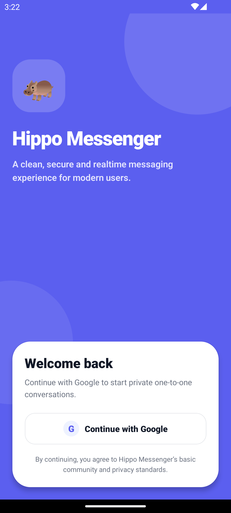
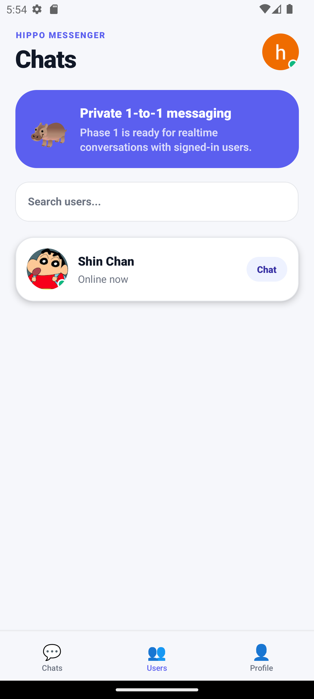
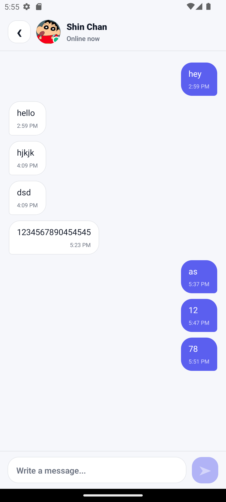

# 🦛 Hippo Messenger

<div align="center">

<!--  -->

### A clean, modern and realtime one-to-one messenger built with React Native and Firebase.

Hippo Messenger is a professional Phase 1 chat application focused on secure Google authentication, realtime user discovery, online presence, and private one-to-one messaging using Firebase Realtime Database.

</div>

---

<div align="center">


</div>

---

## ✨ Overview

**Hippo Messenger** is a realtime messaging app built with **React Native**, **Firebase Authentication**, **Google Sign-In**, and **Firebase Realtime Database**.

The current version is focused on **Phase 1**, which includes a complete and working foundation for private one-to-one messaging. It is designed with a clean UI, scalable folder structure, realtime updates, and Firebase-backed authentication.

---

## 🚀 Phase 1 Features

### Authentication

* Google Sign-In authentication
* Firebase Auth session handling
* Auto user profile creation after login
* Logout support
* Google Play Services availability handling
* Add Google Account fallback flow for Android devices

### User System

* Realtime users list
* Current user excluded from users list
* User profile sync with Firebase
* User name, email, photo, online status and last seen support
* Search users by name or email

### One-to-One Chat

* Private chat room generation between two users
* Unique chat ID based on both user IDs
* Realtime message sending
* Realtime message receiving
* Last message support
* Message timestamp support
* Message length validation
* Empty message validation

### Presence System

* Online/offline user status
* Last seen timestamp
* Firebase `.info/connected` based presence tracking
* Auto offline status using `onDisconnect`

### UI/UX

* Professional login screen
* Modern chat list screen
* Clean chat conversation screen
* Reusable avatar component
* Reusable chat bubble component
* Empty state components
* Responsive SafeArea layout
* Polished card-based interface

---

## 📱 Screenshots

<p align="center">
  <table>
    <tr>
      <td align="center">
        <b>Login Screen</b><br><br>
        
      </td>
      <td align="center">
        <b>Chat List</b><br><br>
        
      </td>
      <td align="center">
        <b>Chat Screen</b><br><br>
        
      </td>
    </tr>
  </table>
</p>

---

## 🛠️ Tech Stack

| Technology                 | Purpose                     |
| -------------------------- | --------------------------- |
| React Native               | Mobile app framework        |
| TypeScript                 | Type-safe development       |
| Firebase Authentication    | User authentication         |
| Firebase Realtime Database | Realtime chat and user data |
| Google Sign-In             | Social login                |
| React Navigation           | App navigation              |
| Safe Area Context          | Safe screen layout          |

---

## 📂 Project Structure

```txt
src/
  components/
    Avatar.tsx
    ChatBubble.tsx
    EmptyState.tsx
    UserCard.tsx

  config/
    google.ts

  constants/
    theme.ts

  navigation/
    RootNavigator.tsx
    types.ts

  screens/
    ChatScreen.tsx
    HomeScreen.tsx
    LoginScreen.tsx
    SplashScreen.tsx

  services/
    accountSettingsService.ts
    authService.ts
    chatService.ts
    presenceService.ts
    userService.ts

  types/
    index.ts

  utils/
    chat.ts
    time.ts

App.tsx
```

---

## 🔥 Firebase Database Structure

```json
{
  "users": {
    "uid_1": {
      "uid": "uid_1",
      "name": "User Name",
      "email": "user@example.com",
      "photoURL": "https://example.com/avatar.png",
      "online": true,
      "lastSeen": 1710000000000,
      "createdAt": 1710000000000,
      "updatedAt": 1710000000000
    }
  },

  "chatRooms": {
    "uid_1_uid_2": {
      "chatId": "uid_1_uid_2",
      "members": {
        "uid_1": true,
        "uid_2": true
      },
      "memberInfo": {
        "uid_1": {
          "uid": "uid_1",
          "name": "User One",
          "email": "one@example.com",
          "photoURL": null
        },
        "uid_2": {
          "uid": "uid_2",
          "name": "User Two",
          "email": "two@example.com",
          "photoURL": null
        }
      },
      "lastMessage": {
        "text": "Hello",
        "senderId": "uid_1",
        "receiverId": "uid_2",
        "type": "text"
      },
      "createdAt": 1710000000000,
      "updatedAt": 1710000000000
    }
  },

  "messages": {
    "uid_1_uid_2": {
      "message_id": {
        "id": "message_id",
        "text": "Hello",
        "senderId": "uid_1",
        "receiverId": "uid_2",
        "type": "text",
        "createdAt": 1710000000000
      }
    }
  }
}
```

---

## ⚙️ Installation

### 1. Clone the repository

```bash
git clone https://github.com/YOUR_USERNAME/hippo-messenger.git
cd hippo-messenger
```

### 2. Install dependencies

```bash
npm install
```

### 3. Install iOS pods

```bash
cd ios
pod install
cd ..
```

### 4. Start Metro

```bash
npx react-native start --reset-cache
```

### 5. Run Android

```bash
npx react-native run-android
```

### 6. Run iOS

```bash
npx react-native run-ios
```

---

## 🔐 Firebase Setup

### 1. Create Firebase Project

Go to Firebase Console and create a new project.

### 2. Add Android App

Use your Android package name, for example:

```txt
com.hippomessenger
```

### 3. Add SHA Fingerprints

Run:

```bash
cd android
gradlew signingReport
```

Copy the **SHA-1** and **SHA-256** from the debug variant and add them in:

```txt
Firebase Console
→ Project Settings
→ Your Android App
→ Add fingerprint
```

### 4. Download `google-services.json`

Place the file here:

```txt
android/app/google-services.json
```

### 5. Enable Google Authentication

```txt
Firebase Console
→ Authentication
→ Sign-in method
→ Google
→ Enable
```

### 6. Enable Realtime Database

```txt
Firebase Console
→ Realtime Database
→ Create Database
```

---

## 🔑 Google Web Client ID

Open:

```txt
android/app/google-services.json
```

Find the OAuth client where:

```json
"client_type": 3
```

Copy its `client_id` and paste it in:

```ts
// src/config/google.ts

export const GOOGLE_WEB_CLIENT_ID =
  'YOUR_WEB_CLIENT_ID.apps.googleusercontent.com';
```

---

## 🧩 Environment Requirements

* Node.js
* React Native CLI setup
* Android Studio
* Java JDK
* Firebase project
* Android emulator with Google Play Services or a real Android device
* Google account added on emulator/device for testing Google Sign-In

---

## 🧱 Android Notes

Make sure your `android/app/build.gradle` package is the same as your Firebase Android package.

```gradle
namespace "com.hippo"

defaultConfig {
    applicationId "com.hippo"
}
```

If you change the package name, update it everywhere:

```txt
Firebase Android App
android/app/build.gradle
google-services.json
AndroidManifest.xml if required
```

---

## 🛡️ Firebase Realtime Database Rules

```json
{
  "rules": {
    ".read": false,
    ".write": false,

    "users": {
      ".indexOn": ["name", "updatedAt"],

      "$uid": {
        ".read": "auth != null",
        ".write": "auth != null && auth.uid === $uid",

        "uid": {
          ".validate": "newData.val() === $uid"
        },
        "name": {
          ".validate": "newData.isString() && newData.val().length > 0 && newData.val().length <= 80"
        },
        "email": {
          ".validate": "newData.isString()"
        },
        "photoURL": {
          ".validate": "newData.val() == null || newData.isString()"
        },
        "online": {
          ".validate": "newData.isBoolean()"
        },
        "lastSeen": {
          ".validate": "newData.isNumber()"
        },
        "createdAt": {
          ".validate": "newData.isNumber()"
        },
        "updatedAt": {
          ".validate": "newData.isNumber()"
        }
      }
    },

    "chatRooms": {
      "$chatId": {
        ".read": "auth != null && data.child('members').child(auth.uid).val() === true",
        ".write": "auth != null && newData.child('members').child(auth.uid).val() === true",

        "members": {
          "$uid": {
            ".validate": "newData.isBoolean()"
          }
        },

        "memberInfo": {
          "$uid": {
            ".validate": "newData.hasChildren(['uid', 'name'])"
          }
        },

        "lastMessage": {
          ".validate": "newData.hasChildren(['text', 'senderId', 'receiverId', 'type'])"
        },

        "createdAt": {
          ".validate": "newData.isNumber()"
        },

        "updatedAt": {
          ".validate": "newData.isNumber()"
        }
      }
    },

    "messages": {
      "$chatId": {
        ".indexOn": ["createdAt"],
        ".read": "auth != null && root.child('chatRooms').child($chatId).child('members').child(auth.uid).val() === true",

        "$messageId": {
          ".write": "auth != null && root.child('chatRooms').child($chatId).child('members').child(auth.uid).val() === true && newData.child('senderId').val() === auth.uid",
          ".validate": "newData.hasChildren(['id', 'text', 'senderId', 'receiverId', 'type', 'createdAt']) && newData.child('id').isString() && newData.child('text').isString() && newData.child('text').val().length > 0 && newData.child('text').val().length <= 2000 && newData.child('senderId').isString() && newData.child('receiverId').isString() && newData.child('type').val() === 'text' && newData.child('createdAt').isNumber()"
        }
      }
    }
  }
}
```

---

## 🧠 Core App Flow

```txt
User opens app
        ↓
Firebase checks auth session
        ↓
If not logged in → Login Screen
        ↓
User signs in with Google
        ↓
Firebase Auth creates session
        ↓
User profile is created/updated in Realtime Database
        ↓
Presence system marks user online
        ↓
Home screen shows other users
        ↓
User selects another user
        ↓
Private chat room opens
        ↓
Messages sync in realtime
```

---

## 🧪 Troubleshooting

### Google Sign-In button does nothing

Check:

```txt
- Emulator has Google Play Services
- A Google account is added on the emulator/device
- Google provider is enabled in Firebase Authentication
- SHA-1 and SHA-256 are added in Firebase
- Fresh google-services.json is downloaded
```

### DEVELOPER_ERROR

Usually caused by:

```txt
- Wrong SHA-1
- Wrong package name
- Wrong Web Client ID
- Old google-services.json
- Google provider disabled
```

Run:

```bash
npx @react-native-google-signin/config-doctor
```

### Firebase deprecated API warning

Use the modular React Native Firebase API:

```ts
getDatabase()
ref()
get()
set()
update()
onValue()
query()
orderByChild()
limitToLast()
ServerValue.TIMESTAMP
```

Avoid older namespaced style:

```ts
database().ref()
database.ServerValue.TIMESTAMP
```

---

## 🗺️ Roadmap

### Phase 1

* Google Sign-In
* Realtime users list
* One-to-one chat
* Online/offline presence
* Last seen
* Firebase security rules

### Phase 2

* Recent chats screen
* Message delivery status
* Typing indicator
* Unread message count
* Push notifications
* Profile edit screen
* Better empty states
* Image messages

### Phase 3

* Group chats
* Voice messages
* Message reactions
* Message reply support
* Message delete/edit
* Chat themes
* Media upload with Firebase Storage

### Phase 4

* End-to-end encryption research
* Advanced moderation
* Block/report users
* Admin dashboard
* Production analytics
* Crash reporting

---

## 🤝 Contributing

Contributions are welcome.

To contribute:

```bash
git fork
git checkout -b feature/your-feature-name
git commit -m "feat: add your feature"
git push origin feature/your-feature-name
```

Then open a Pull Request.

---

## 📦 Build Commands

### Android Debug

```bash
npx react-native run-android
```

### Android Clean Build

```bash
cd android
gradlew clean
cd ..
npx react-native run-android
```

### Android Release APK

```bash
cd android
gradlew assembleRelease
```

### Android Release Bundle

```bash
cd android
gradlew bundleRelease
```

---

## 📌 Recommended Git Commit Messages

```bash
git commit -m "feat: add Firebase Google Sign-In authentication"
git commit -m "feat: add realtime one-to-one chat system"
git commit -m "feat: add user presence and last seen tracking"
git commit -m "fix: resolve Google Sign-In developer error configuration"
git commit -m "docs: add professional project readme"
```

---

## 📄 License

This project is licensed under the **MIT License**.

```txt
MIT License

Copyright (c) 2026 Hippo Messenger

Permission is hereby granted, free of charge, to any person obtaining a copy
of this software and associated documentation files, to deal in the Software
without restriction, including without limitation the rights to use, copy,
modify, merge, publish, distribute, sublicense, and/or sell copies of the
Software, subject to the following conditions:

The above copyright notice and this permission notice shall be included in all
copies or substantial portions of the Software.
```

---

## 👨‍💻 Author

Made with ❤️ for modern realtime communication.

```txt
Project: Hippo Messenger
Type: React Native Firebase Chat App
Status: Phase 1 Complete
```

---

<div align="center">

### 🦛 Hippo Messenger

**Fast. Friendly. Realtime.**

If you like this project, consider giving it a ⭐ on GitHub.

</div>
